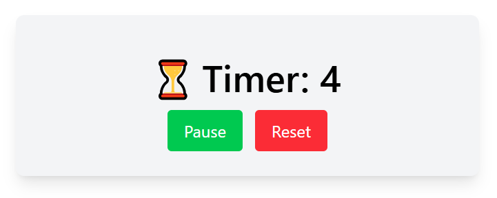

# Timer UI

A simple, elegant timer application built with React and Vite, featuring a clean interface with start/pause and reset functionality.



## Features

- **Start/Pause Timer**: Toggle timer with a single button
- **Reset Functionality**: Reset timer back to zero
- **Persistent State**: Timer value persists across browser sessions using localStorage
- **Responsive Design**: Clean, centered design that works on different screen sizes
- **Keyboard Navigation**: Focus management for better accessibility
- **Real-time Updates**: Timer updates every second when running

## Technologies Used

- **React 19** - Frontend framework
- **Vite** - Build tool and development server
- **Tailwind CSS 4** - Utility-first CSS framework
- **ESLint** - Code linting
- **Prettier** - Code formatting

## Getting Started

### Prerequisites

- Node.js (version 16 or higher)
- npm or yarn

### Installation

1. Clone the repository:
```bash
git clone <repository-url>
cd timer-ui
```

2. Install dependencies:
```bash
npm install
```

3. Start the development server:
```bash
npm run dev
```

4. Open your browser and navigate to `http://localhost:5173`

## Available Scripts

- `npm run dev` - Start development server
- `npm run build` - Build for production
- `npm run preview` - Preview production build
- `npm run lint` - Run ESLint

## Project Structure

```
src/
├── components/
│   ├── Timer.jsx          # Main timer component with state management
│   ├── TimerControls.jsx  # Start/Pause and Reset buttons
│   └── TimerDisplay.jsx   # Timer value display
├── App.jsx               # Root component
├── main.jsx             # Application entry point
└── index.css            # Global styles (Tailwind imports)
```

## Component Architecture

- **Timer**: Main component that manages timer state, localStorage persistence, and interval handling
- **TimerDisplay**: Presentational component for displaying the current timer value
- **TimerControls**: Button controls for starting/pausing and resetting the timer

## Key Features Implementation

### Persistent State
The timer value is automatically saved to localStorage and restored when the application loads:

```javascript
const [time, setTime] = useState(() => {
    return Number(localStorage.getItem("time") || 0);
});
```

### Timer Management
Uses `useRef` to manage the interval reference and `useEffect` for cleanup:

```javascript
const timerRef = useRef(null);

const toggleTimer = () => {
    if (isRunning) {
        clearInterval(timerRef.current);
    } else {
        timerRef.current = setInterval(() => {
            setTime((prevTime) => prevTime + 1);
        }, 1000);
    }
    setIsRunning(!isRunning);
};
```

## Styling

The application uses Tailwind CSS for styling with:
- Responsive design principles
- Hover effects on buttons
- Clean, modern card-based layout
- Consistent spacing and typography

## Browser Compatibility

- Modern browsers supporting ES6+ features
- Chrome, Firefox, Safari, Edge (latest versions)

## Contributing

1. Fork the repository
2. Create a feature branch: `git checkout -b feature-name`
3. Commit your changes: `git commit -am 'Add some feature'`
4. Push to the branch: `git push origin feature-name`
5. Submit a pull request

## License

This project is open source and available under the [MIT License](LICENSE).

## Future Enhancements

- [ ] Custom timer duration input
- [ ] Multiple timer support
- [ ] Sound notifications
- [ ] Timer presets (Pomodoro, etc.)
- [ ] Dark mode toggle
- [ ] Timer history/logs